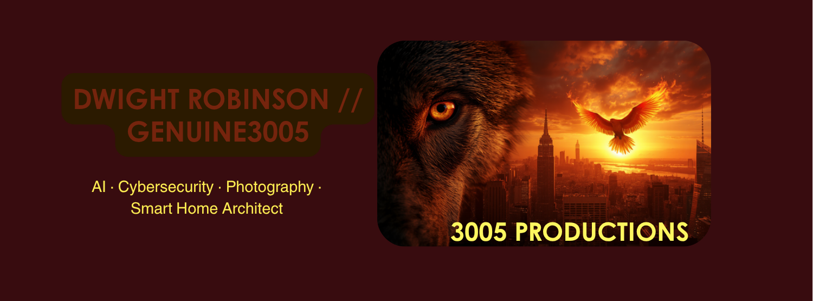

<!--
  GENUINE3005 — GitHub Profile README
  Banner: Palette Canva export — dark slate, phoenix+wolf motif, GENUINE3005 typography
  Push: drobinson3005/drobinson3005
-->

# Dwight Robinson `// Genuine3005`

### Enterprise IT Leader · Cybersecurity Scholar · Creative Technologist · AI Systems Architect

*Bronx, New York — Building systems that remember. Securing the infrastructure that matters.*

---

## Who I Am

9+ years in enterprise IT infrastructure — specializing in **C-Suite "white-glove" technical partnership** at world-class organizations: Apple, Lyft, the United Nations International School, MoMA, and currently A Place for Mom.

My work lives at the intersection of **zero-trust security architecture**, **executive endpoint management**, and **AI-powered automation**. I'm not just an IT professional — I'm a systems thinker who builds infrastructure that scales, secures, and serves people at the highest level.

I hold a psychology degree alongside a cybersecurity B.S. in progress — because understanding *people* is just as important as hardening the systems they rely on. That combination is my edge.

Outside the enterprise, I operate **3005 Productions LLC**, a creative technology company focused on high-end documentary photography, smart home automation architecture, cybersecurity hardening, and a custom AI-driven corporate operating system I built from the ground up.

---

## What I Build

### 🏢 3005 Productions LLC — Corporate AI Operating System
> *Built entirely in Claude Code. Live and running.*

A fully autonomous multi-agent corporate OS with **39 specialized AI agents** across three tiers (ELT · SLT · Staff). It handles security threat modeling, weekly compliance sweeps, Friday assurance scans, session governance, intake pipelines, personal brand management, and more — all orchestrated through a custom hook and cron automation layer on GitHub.

This is not a proof-of-concept. It's a production system. Every session is documented, every agent has a mandate, every decision has a paper trail.

### 🧠 RememberMe — Memory Preservation Platform
> *What gets forgotten is what gets lost.*

A subsidiary venture focused on personal and family memory preservation — capturing and structuring histories before they fade. AI synthesis meets archival intelligence. Currently in active development.

### 📸 Photography & Visual Production
High-end digital and documentary photography. Identity work, event coverage, and visual storytelling for individuals and brands in the New York area.

---

## Enterprise Tech Stack

**Executive Support & MDM**

**Identity & SaaS**

**AV & Hybrid Collaboration**

**ITSM & Documentation**

**Security & Infrastructure**

**AI & Automation**

---

## Career Highlights

| Role | Organization | Tenure |
|---|---|---|
| Technology Support Partner — Executive Services | **A Place for Mom** | March 2026 – Present |
| IT Support Team Lead (C-Suite Partner) | **Lyft** | Oct 2024 – March 2026 |
| IT System Specialist / AV Technician | **United Nations International School** | July 2024 – Oct 2024 |
| Client Service Technician | **Museum of Modern Art (MoMA)** | Oct 2023 – July 2024 |
| Technical Specialist + Training Lead | **Apple** | Oct 2019 – Oct 2023 |

---

## Education

| Degree | Institution | Status |
|---|---|---|
| B.S. Cybersecurity *(Alpha Sigma Lambda Honor Society)* | University of Maryland Global Campus | In Progress — May 2026 |
| A.A. Psychology | Borough of Manhattan Community College | ✅ Completed 2023 |
| A+ · Computer Science | Year Up | ✅ Completed 2018 |

**Certifications:** JAMF Pro Associate · Project Management (UMGC) · Microsoft PowerPoint 2021

---

*"The system either serves you or it controls you. I build systems that serve."*

