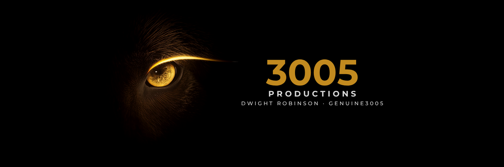

<!--
  GENUINE3005: GitHub Profile README
  Banner: Palette Canva export: dark slate, phoenix+wolf motif, GENUINE3005 typography
  Push: drobinson3005/drobinson3005
-->

# Dwight Robinson `// Genuine3005`

### Enterprise IT Leader · Cybersecurity Graduate · Creative Technologist · AI Systems Architect

*New York. Building systems that remember. Securing the infrastructure that matters.*

---

## Who I Am

8+ years in enterprise IT, most of it as the **white-glove technology partner to executive teams**: Apple, MoMA, the United Nations International School, Lyft, and now A Place for Mom.

My work sits where **security**, **executive endpoint management** and **AI automation** meet. When I see the same risky task done by hand again and again, I build a safer way to do it.

I hold an A.A. in Psychology and a B.S. in Cybersecurity. Understanding *people* matters as much as hardening the systems they rely on.

Outside the enterprise, I operate **3005 Productions**, a creative technology company focused on high-end documentary photography, smart home automation architecture, cybersecurity hardening, and a custom AI-driven corporate operating system I built from the ground up.

---

## What I Build

### 🏢 3005 Productions: Corporate AI Operating System
> *Built entirely in Claude Code. Live and running.*

A multi-agent corporate operating system with **46 specialized AI agents** across three tiers (ELT · SLT · Staff). It handles security threat modeling, weekly compliance and website scans, session governance, intake, personal brand work and more, run through a custom hook and scheduled-automation layer on GitHub. I review and approve every change it makes.

This is not a proof-of-concept. It's a production system. Every session is documented, every agent has a mandate, every decision has a paper trail.

The automation layer is **self-healing**: cloud cron routines run layered assurance scans that file partial results instead of failing silently, backed by a local verification watchdog that catches and recovers any missed run.

### 🧠 RememberMe: Memory Preservation Platform
> *What gets forgotten is what gets lost.*

A memory companion for people and families: capturing and organizing the moments that matter before they fade. Now past concept, with an MVP feature spec, product requirements and a privacy and security baseline defined, plus a partnership-funded accessibility model for people facing memory loss.

### 📸 Photography & Visual Production
Portraits, events, documentary and creative photography across New York City. See the work at [3005productions.com](https://3005productions.com).

---

## Enterprise Tech Stack

**Executive Support & MDM**

**Identity & SaaS**

**AV & Hybrid Collaboration**

**ITSM & Documentation**

**Security & Infrastructure**

**AI & Automation**

---

## Career Highlights

| Role | Organization | Tenure |
|---|---|---|
| Technology Support Partner, Executive Services | **A Place for Mom** | March 2026 to Present |
| IT Support Specialist / AV Technician (Contract) | **Lyft** | Oct 2024 to March 2026 |
| IT Systems Specialist / AV Technician (Contract) | **United Nations International School** | July 2024 to Oct 2024 |
| Client Service Technician (Contract) | **Museum of Modern Art (MoMA)** | Oct 2023 to July 2024 |
| Technical Specialist, then Training Lead | **Apple** | Oct 2019 to Oct 2023 |

---

## Education

| Degree | Institution | Status |
|---|---|---|
| B.S. Cybersecurity, Certificate in Project Management *(Alpha Sigma Lambda Honor Society)* | University of Maryland Global Campus | ✅ Completed 2026 |
| A.A. Psychology | Borough of Manhattan Community College | ✅ Completed |
| Information Technology program | Year Up | ✅ Alumnus |

**Certifications:** CompTIA A+ · Jamf Pro Certified · Apple Certified Mac Technician (ACMT) · Apple Certified iOS Technician (ACiT) · Microsoft PowerPoint 2021

---

*"The system either serves you or it controls you. I build systems that serve."*

